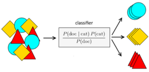

# Modelo classificador de bons pagadores de crédito com Naive Bayes

Este projeto visa criar um modelo de Machine Learning, utilizando o algoritmo Naive Bayes, para classificar clientes de crédito como bons ou maus pagadores, baseado em um dataset histórico.

## Objetivo

O objetivo principal deste projeto é desenvolver um modelo preditivo capaz de analisar as características de um novo cliente e determinar a probabilidade dele ser um bom pagador de crédito.

## Dataset

O dataset utilizado é composto por dados de diversos clientes de um banco alemão que solicitaram crédito. Para cada cliente, são fornecidas várias características (atributos) e uma classificação final indicando se o cliente foi um bom ou mau pagador.

## Algoritmo Utilizado

O algoritmo escolhido para este classificador é o Naive Bayes. Baseado no Teorema de Bayes, este algoritmo assume que as características de um cliente são independentes entre si, o que simplifica o cálculo das probabilidades e a classificação.

## Estrutura do Código

O código Python, desenvolvido em um notebook Colab, segue os seguintes passos:

1.  **Importação de Bibliotecas:** Importa as bibliotecas necessárias para manipulação de dados (pandas), divisão de datasets (sklearn.model_selection), utilização do algoritmo Naive Bayes (sklearn.naive_bayes), pré-processamento (sklearn.preprocessing), e avaliação do modelo (sklearn.metrics, yellowbrick.classifier).
2.  **Conhecendo o Dataset:** Carrega o dataset 'Credit.csv', exibe suas dimensões e as primeiras linhas para entendimento da estrutura dos dados.
3.  **Transformação de Atributos:** Realiza o pré-processamento dos dados categóricos, transformando-os em representações numéricas utilizando `LabelEncoder`. Isso é crucial, pois a maioria dos algoritmos de Machine Learning trabalha melhor com dados numéricos. Para garantir a consistência, um `LabelEncoder` separado é criado para cada coluna categórica.
4.  **Divisão entre Treino e Teste:** Divide o dataset em conjuntos de treinamento e teste (70% para treinamento, 30% para teste) para avaliar a performance do modelo em dados não vistos durante o treinamento.
5.  **Treinamento e Acurácia do Modelo:**
    *   Cria uma instância do classificador `GaussianNB`.
    *   Treina o modelo utilizando o conjunto de treinamento.
    *   Realiza previsões no conjunto de teste.
    *   Calcula e exibe a matriz de confusão para visualizar os resultados da classificação.
    *   Calcula e exibe a acurácia do modelo, indicando a porcentagem de acertos.
    *   Utiliza a biblioteca `Yellowbrick` para visualizar a matriz de confusão de forma gráfica, facilitando a interpretação.
6.  **Classificação de um Novo Cliente:**
    *   Carrega os dados de um novo cliente a partir do arquivo 'NovoCliente.csv'.
    *   Aplica as mesmas transformações de atributos (usando os `LabelEncoder`s criados anteriormente) nos dados do novo cliente.
    *   Utiliza o modelo treinado para prever a classe (bom ou mau pagador) do novo cliente.

## Como Executar

Para executar este projeto, siga os passos abaixo:

1.  Clone ou faça o download do notebook Colab (`.ipynb`).
2.  Certifique-se de que os arquivos `Credit.csv` e `NovoCliente.csv` estejam disponíveis no ambiente de execução (por exemplo, no Google Drive se estiver usando o Colab).
3.  Abra o notebook no Google Colab.
4.  Execute as células sequencialmente.

## Bibliotecas Necessárias

*   pandas
*   scikit-learn
*   yellowbrick

Estas bibliotecas podem ser instaladas via pip, caso não estejam disponíveis no seu ambiente. No Colab, a maioria delas já vem pré-instalada. Se precisar instalar, pode usar comandos como:
bash pip install pandas scikit-learn yellowbrick

## Resultados

O modelo treinado obteve uma acurácia de aproximadamente 71% no conjunto de teste. A matriz de confusão visualizada com Yellowbrick indica que o modelo é particularmente eficaz em identificar bons pagadores de crédito.

Ao classificar o novo cliente, o modelo previu que ele seria um bom pagador de crédito.
